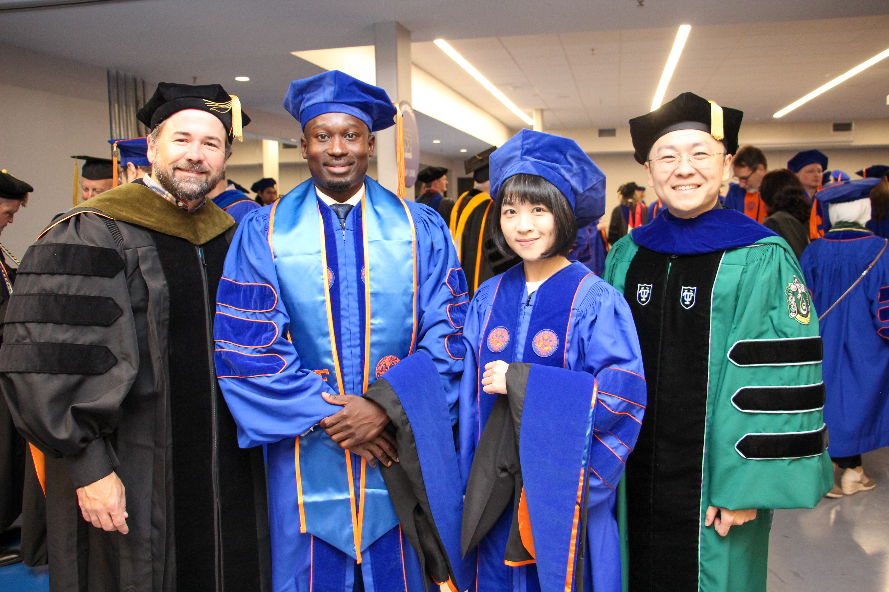
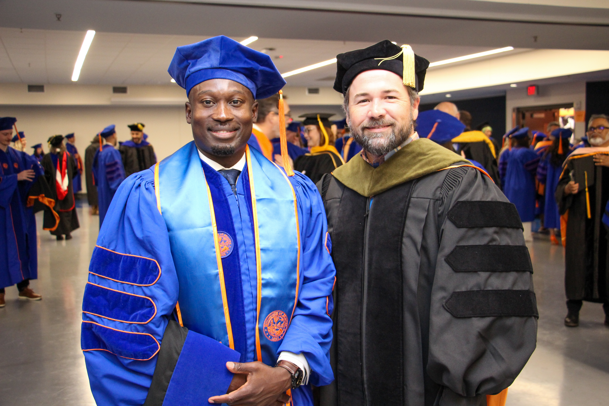

Big congratulations to **Dr.** [Asinamai Ndai](https://directory.ufhealth.org/ndai-asinamai), who graduated today. I had the pleasure of hooding him at today's ceremony. Asinamai's story is really an amazing one, coming as a pharmacist from Nigeria, to the U.S. to complete his master's work at Notre Dame, and then eventually joining Dr. Scott Vouri's lab here as a PhD student. When Scott left, Asinamai came over to CVmedLab and has been a wonderful fit for our group the last several years. He's secured a job as a consultant for Boehringer Ingelheim, a pharmaceutical company based out of Germany. We of course wish him all the best, and since he'll be working remote, he'll still be around to finish up a few things.

Also had the pleasure of seeing newly-minted Dr. [Piaopiao Li](https://directory.ufhealth.org/li-piaopiao), our other [POP](https://pop.pharmacy.ufl.edu/) this semester, along with her advisor, and former POP faculty member, [Dr. Hui Shao](https://sph.emory.edu/profile/faculty/hui-shao). Both are pictured below with Asinamai and I.

