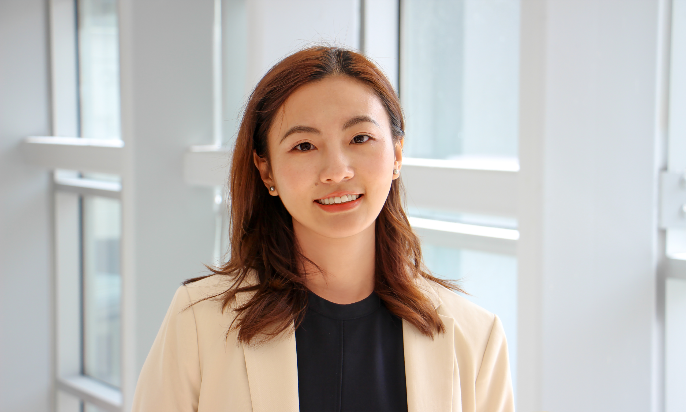

:::::::::::::::::::::::::::::::::::::::::: grid
::: g-col-12
## [People]{style="color: #1E354B"}

##### Faculty {style="color: #7f7f7f"}
:::

::: g-col-2
{fig-align="center" fig-alt="Image of Dr. Steven Smith"}
:::

::: g-col-10
[**Steven Smith, PharmD, MPH**]{style="color: #1E354B"} is Chair & Associate Professor in the [Department of Pharmaceutical Outcomes & Policy](https://pop.pharmacy.ufl.edu/) ([College of Pharmacy](https://pharmacy.ufl.edu/)) and PI of the [CVmedLab](https://cvmedlab.org/) at the [University of Florida](https://www.ufl.edu/). He has a secondary (courtesy) appointment in the [Division of Cardiovascular Medicine](https://cardiology.medicine.ufl.edu/) ([College of Medicine](https://med.ufl.edu)). He also serve as Co-Director for the [UF Center for Integrative Cardiovascular and Metabolic Disease](https://cicmd.center.ufl.edu/). His research methodology is fairly wide-ranging, encompassing clinical trial work and observational methods (e.g., with claims and electronic health record data), though the therapeutic focus is primarily in the field of hypertension and related cardiometabolic disease.
:::

::: g-col-2
{fig-align="center" fig-alt="Image of Dr. Shailina Keshwani"}
:::

::: g-col-10
[**Shailina Keshwani, PhD**]{style="color: #1E354B"} is a Research Assistant Professor in the Department of Pharmaceutical Outcomes and Policy. Her research is focused on the intersection of pain and cardiovascular disease and specifically use of analgesics in patients with cardiovascular disease. She is also very involved in a variety of broader cardiovascular research across the lab.
:::

::: g-col-12
##### Current Grad Students {style="color: #7f7f7f"}
:::

::: g-col-2
{fig-align="center" fig-alt="Image of Dr. Kayla Smith"}
:::

::: g-col-10
[**Kayla Smith, PharmD**]{style="color: #1E354B"} is a PhD student in the Department of Pharmaceutical Outcomes and Policy. She previously worked with me on several project characterizing antihypertensive use patterns during her Doctor of Pharmacy degree program.
:::

::: g-col-2
{fig-align="center" fig-alt="Image of Shu Niu"}
:::

::: g-col-10
[**Shu Niu, MS**]{style="color: #1E354B"} is a PhD student in the Department of Pharmaceutical Outcomes and Policy. She is interested in the intersection of oncology drugs and cardiovascular outcomes.
:::

::: g-col-2
{fig-align="center" fig-alt="Image of Tram Nguyen"}
:::

::: g-col-10
[**Ngoc Thuy Tram (Tram) Nguyen, MS**]{style="color: #1E354B"} is a PhD student in the Department of Pharmaceutical Outcomes and Policy.
:::

::: g-col-12
##### Research Coordinator(s) {style="color: #7f7f7f"}
:::

::: g-col-2
{fig-align="center" fig-alt="Image of Veronica Donoso"}
:::

::: g-col-10
[**Hipatia (Veronica) Donoso**]{style="color: #1E354B"} is the Assistant Director for the [UF Center for Integrative Cardiovascular and Metabolic Disease](https://cicmd.center.ufl.edu/). She most recently was Project Coordinator for the [Project ENFERMERÍA at UCF](https://access.ucf.edu/hispanic-serving-institution/enfermeria/), and prior to that, served as research coordinator for the [CICMD](https://cicmd.center.ufl.edu/). From time-to-time, she also helps us in a pinch as a research coordinator in the CVmedLab.
:::

::: g-col-2
{fig-align="center" fig-alt="Image of David Smith"}
:::

::: g-col-10
[**David Smith**]{style="color: #1E354B"} is a Research Coordinator in the Department of Pharmacotherapy & Translational Research. He serves as our primary coordinator on the [Mino-TRH trial](https://ufhealth.org/clinical-trials/mino-trh).
:::

::: g-col-12
##### Former Lab Members {style="color: #7f7f7f"}
:::

::: g-col-2
{fig-align="center" fig-alt="Image of Dr. Asinamai Ndai"}
:::

::: g-col-10
[**Asinamai Ndai, MS**]{style="color: #1E354B"} was a PhD student in the Department of Pharmaceutical Outcomes and Policy. His research is focused on the intersection of hypertension and HIV. He is currently a consultant in the pharmaceutical industry. 
:::

::: g-col-2
{fig-align="center" fig-alt="Image of Dr. Earl Morris"}
:::

::: g-col-10
[**Earl Morris, PharmD, MPH, PhD**]{style="color: #1E354B"} earned his PhD in the CVmedLab (and Scott Vouri's lab) in the Department of Pharmaceutical Outcomes and Policy. His dissertation focused on xanthine oxidase inhibitor utilization and their comparative effects on cardiovascular and related outcomes, funded by an [American Heart Association](https://www.heart.org/) Predoctoral Fellowship award. Earl is now on Faculty in the POP Department.
:::

::: g-col-2
{fig-align="center" fig-alt="Image of Marta Walsh"}
:::

::: g-col-10
[**Marta Walsh, MS**]{style="color: #1E354B"} was our data analyst from from 2021 through early 2023. She now works as a business analyst for the Mayo Clinic in Rochester, MN.
:::

::: g-col-2
{fig-align="center" fig-alt="Image of Dr. Mirian Hay-Roe"}
:::

::: g-col-10
[**Mirian Hay-Roe, PhD**]{style="color: #1E354B"} is a former Research Coordinator for the [UF Center for Integrative Cardiovascular and Metabolic Disease](https://cicmd.center.ufl.edu/).
:::

::: g-col-2
{fig-align="center" fig-alt="Image of Dr. Christie Monahan"}
:::

::: g-col-10
[**Christie Monahan, PharmD**]{style="color: #1E354B"} was the 2021-2023 clinical postdoctoral fellow in the Departments of Pharmacotherapy and Translational Research and Community Health and Family Medicine. Her work was primarily centered on pharmacist-managed transitions of care as well as continuous glucose monitoring in patients with diabetes.
:::

::: g-col-2
{fig-align="center" fig-alt="Image of Dr. Raj Desai"}
:::

::: g-col-10
[**Raj Desai, PhD**]{style="color: #1E354B"} was my first PhD student in the Department of Pharmaceutical Outcomes and Policy. His work was primarily centered on use of secondary datasets (administrative claims, EHR) for studying cardiovascular outcomes and performing comparative effectiveness research in patients with complicated antihypertensive regimens. He is now an Associate - Health Economics and Outcomes Research at the Analysis Group in Boston, MA.
:::

::: g-col-2
{fig-align="center" fig-alt="Image of Dr. Chris Piszczatoski"}
:::

::: g-col-10
[**Chris Piszczatoski, PharmD**]{style="color: #1E354B"} was our 2019-2021 postdoctoral fellow in the Departments of Pharmacotherapy and Translational Research and Community Health and Family Medicine. He is now on staff in the UF Community Health and Family Medicine.
:::

::: g-col-2
{fig-align="center" fig-alt="Image of Dr. Ghadeer Dawwas"}
:::

::: g-col-10
[**Ghadeer Dawwas, PhD**]{style="color: #1E354B"} was a postdoctoral fellow (2019-2020) in pharmacoepidemiology, with a focus on cardiometabolic outcomes of novel antidiabetic agents. She is now on faculty at Vanderbilt University.
:::

::: g-col-2
{fig-align="center" fig-alt="Image of Dr. Scott Garland"}
:::

::: g-col-10
[**Scott Garland, PharmD**]{style="color: #1E354B"} was our 2017-2019 postdoctoral fellow in the Departments of Pharmacotherapy and Translational Research and Community Health and Family Medicine. He is now on faculty of the FSU College of Medicine.
:::

::: g-col-2
{fig-align="center" fig-alt="Image of Dr. Andrew Hwang"}
:::

::: g-col-10
[**Andrew Hwang, PharmD**]{style="color: #1E354B"} was our 2015-2017 postdoctoral fellow in the Departments of Pharmacotherapy and Translational Research and Community Health and Family Medicine. He is now on faculty at the Massachusetts College of Pharmacy and Health Sciences.
:::

::: g-col-12
## [Join the Group]{style="color: #1E354B"}

See the [about page](about.qmd) for information on joining the group.
:::
::::::::::::::::::::::::::::::::::::::::::
